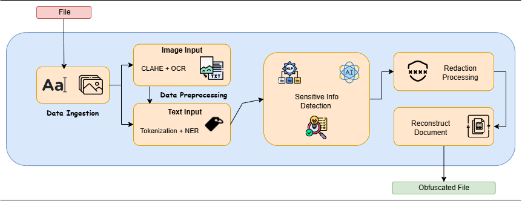

# Obscure
An AI-powered redaction tool that leverages Generative AI to automatically detect and redact sensitive information across multiple formats like text, images, and scanned documents.

ObscureAI will streamline the redaction process, making data sharing faster and more secure across industries such as government, healthcare, and finance. It supports organizations in complying with privacy laws and protects sensitive information during audits or third-party interactions.

## File Description:
`BERT-FT`: Fine-tuning of the BERT model for better NER.(NLP) <br />
`Text-Image-processing`: Pipeline that handles OCR and complete obfuscation in images. <br />
`Text-PDF-processing`: Pipeline that handles OCR and NER and does obfuscation on PDF files.

## Key Features
* Speed: Automating the process will make redaction much faster compared to manual methods.
* Accuracy: AI will help ensure you don’t miss anything important while redacting.
* Security: Ensuring no data leaks, your tool guarantees that organizations can confidently share information without violating privacy laws.

## Regulatory Background
**GDPR (General Data Protection Regulation)** Applies to all personal data of EU residents, regardless of processing location. Stricter consent requirements and rights such as data deletion and portability. **HIPAA (Health Insurance Portability and Accountability Act)** Focuses on the privacy and security of Protected Health Information (PHI) in the healthcare sector. Less comprehensive than GDPR, with specific breach notification requirements.

### **Key Differences:**
Scope: HIPAA focuses on healthcare data; GDPR encompasses all personal data.
Jurisdiction: HIPAA is US-specific; GDPR is EU-wide.
Consent: HIPAA allows some disclosures without consent; GDPR requires it.
Breach Notification: HIPAA has specific requirements; GDPR mandates 72-hour notifications.
Right to be Forgotten: GDPR allows data deletion requests; HIPAA does not.
Data Portability: GDPR allows data transfers; HIPAA does not.

### **Labels:** 
              ['O', 'B-NAME', 'I-NAME', 'B-AADHAAR', 'I-AADHAAR', 'B-DL', 'I-DL', 
              'B-PASSPORT', 'I-PASSPORT', 'B-DATE', 'I-DATE', 'B-ADDRESS', 'I-ADDRESS', 
              'B-MOBILE', 'I-MOBILE', 'B-EMAIL', 'I-EMAIL', 'B-BANK', 'I-BANK', 
              'B-CC', 'I-CC', 'B-MEDICAL', 'I-MEDICAL', 'B-LOAN', 'I-LOAN', 
              'B-PIN', 'I-PIN', 'B-OTP', 'I-OTP', 'B-FINANCIAL', 'I-FINANCIAL', 
              'B-IP', 'I-IP', 'B-LOGIN', 'I-LOGIN', 'B-COOKIES', 'I-COOKIES', 
              'B-CREDIT', 'I-CREDIT', 'B-INSURANCE', 'I-INSURANCE', 'B-GENETIC', 
              'I-GENETIC', 'B-BIOMETRIC', 'I-BIOMETRIC', 'B-CARD', 'I-CARD']
## Flow


1. Data Ingestion: The user uploads a file (Text, Image, PDF, Video).

2. Data Preprocessing: Apply image preprocessing (CLAHE), perform Optical Character Recognition (OCR) to convert image text into machine-readable text.Then, Perform Tokenization (Split text into words/phrases) and NER (Name Entity Relation).

3. AI-based NLP: Identify PII, classified government data, or proprietary corporate details. Use of previously found insights to flag senesitive areas with help of LLMs as per GDPR and HIPAA regulations. 

4. Customizable Redaction: User defines redaction intensity (Basic anonymization or Full obfuscation/AUTO).
Select user-defined rules to target specific types of information.

5. Redaction Processing: Mask sensitive information in text (Remove). For images, Blur or overlay sensitive regions, with help of computer vision and OCR.

6. Reconstruction and Post-Processing: Reconstruct the document while maintaining its original format and layout. Create audit trails for compliance (what was redacted, why, when, by whom).

7. Deliver redacted documents for secure usage.

### OneAPI Usage:
To optimize the provided code using Intel's oneAPI toolkits, we can focus on regions where parallelization, memory management, and performance improvements can be applied. Below is the documentation format outlining the suggested areas for optimization:

---

# Code Optimization Using oneAPI Toolkits

## Optimization Areas

### 1. Tokenization
Use oneAPI's DPC++ to parallelize the tokenization process, particularly when handling large batches of input data.

**Implementation**
- Tokenization can be parallelized across multiple input texts to speed up the preprocessing stage.

```python
# Original Tokenization
tokens = tokenizer(texts, return_tensors="pt", padding=True, truncation=True)

# Optimized with DPC++
import dpctl

def parallel_tokenize(texts):
    with dpctl.device_context("opencl:gpu:0"):
        # Parallel processing of tokenization
        results = [tokenizer(text, return_tensors="pt") for text in texts]
    return results
```

### 2. Batch Processing of Predictions
The model's prediction phase can be optimized by batching multiple sentences together. This will leverage GPU acceleration effectively.

**Implementation**
- Instead of processing each input individually, gather multiple inputs into a batch and perform predictions in one go.

```python
def batch_predict(texts, model, tokenizer, label_list):
    encodings = tokenizer(texts, return_tensors="pt", padding=True, truncation=True)
    
    input_ids = encodings['input_ids']
    attention_mask = encodings['attention_mask']
    
    with torch.no_grad():
        outputs = model(input_ids=input_ids, attention_mask=attention_mask)
    
    logits = outputs.logits
    predicted_label_ids = torch.argmax(logits, dim=2)

    predictions = []
    for idx in range(len(texts)):
        predicted_labels = [label_list[label_id] for label_id in predicted_label_ids[idx]]
        tokens = tokenizer.convert_ids_to_tokens(input_ids[idx].tolist())
        predictions.append(list(zip(tokens, predicted_labels)))
    return predictions
```

### 3. Memory Management
Use oneAPI’s Unified Shared Memory (USM) to manage memory allocation more effectively when preparing data for the model.

**Implementation:**
- Replace standard tensor allocations with USM to improve memory performance and reduce overhead.

```python
import dpctl

# Allocate tensors using USM
def allocate_tensors_using_usm(size):
    with dpctl.device_context("opencl:gpu:0"):
        input_tensor = dpctl.usm_alloc(size, dtype=torch.long)
        return input_tensor
```

### 4. Data Loading Optimization
Use oneAPI's Data Parallelism features to speed up the loading and processing of the dataset.

**Implementation:**
- Implement a parallel data loader that can load and preprocess data concurrently.

```python
from concurrent.futures import ThreadPoolExecutor

def load_and_process_data(file_path):
    df = pd.read_csv(file_path)
    with ThreadPoolExecutor() as executor:
        futures = [executor.submit(preprocess_row, row) for index, row in df.iterrows()]
        results = [future.result() for future in futures]
    return results
```

### 5. Use of Accelerated Libraries
Leverage Intel's oneDNN for optimized deep learning operations, especially for matrix multiplications and convolutions.

**Implementation Suggestion:**
- When performing operations that involve significant tensor computations, consider replacing them with oneDNN-optimized operations.


```python
from oneapi import oneDNN

# Replace standard PyTorch operations with oneDNN optimized operations
def optimized_tensor_operations(tensor1, tensor2):
    result = oneDNN.matmul(tensor1, tensor2)  # Example operation
    return result
```


### Sample:
**Original Image:**

#### **Prompt: Remove Email**
**Ouptu Image:**


# Sample Browser Extension template:
