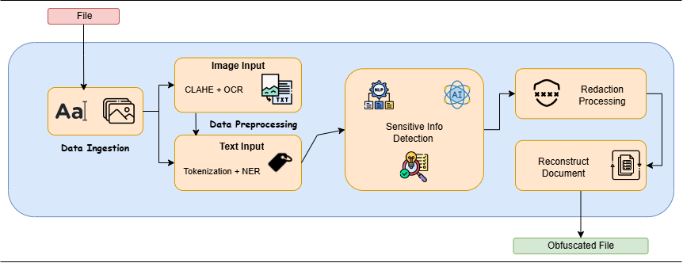

# Obscure
An AI-powered redaction tool that leverages Generative AI to automatically detect and redact sensitive information across multiple formats like text, images, and scanned documents.

ObscureAI will streamline the redaction process, making data sharing faster and more secure across industries such as government, healthcare, and finance. It supports organizations in complying with privacy laws and protects sensitive information during audits or third-party interactions.

## Key Features
* Speed: Automating the process will make redaction much faster compared to manual methods.
* Accuracy: AI will help ensure you don’t miss anything important while redacting.
* Security: Ensuring no data leaks, your tool guarantees that organizations can confidently share information without violating privacy laws.

## Flow

1. Data Ingestion: The user uploads a file (Text, Image, PDF, Video).

2. Data Preprocessing: Apply image preprocessing (CLAHE), perform Optical Character Recognition (OCR) to convert image text into machine-readable text.Then, Perform Tokenization (Split text into words/phrases) and NER (Name Entity Relation).

3. AI-based NLP: Identify PII, classified government data, or proprietary corporate details. Use of previously found insights to flag senesitive areas with help of LLMs as per GDPR and HIPAA regulations. 

4. Customizable Redaction: User defines redaction intensity (Basic anonymization or Full obfuscation/AUTO).
Select user-defined rules to target specific types of information.

5. Redaction Processing: Mask sensitive information in text (Remove). For images, Blur or overlay sensitive regions, with help of computer vision and OCR.

6. Reconstruction and Post-Processing: Reconstruct the document while maintaining its original format and layout. Create audit trails for compliance (what was redacted, why, when, by whom).

7. Deliver redacted documents for secure usage.